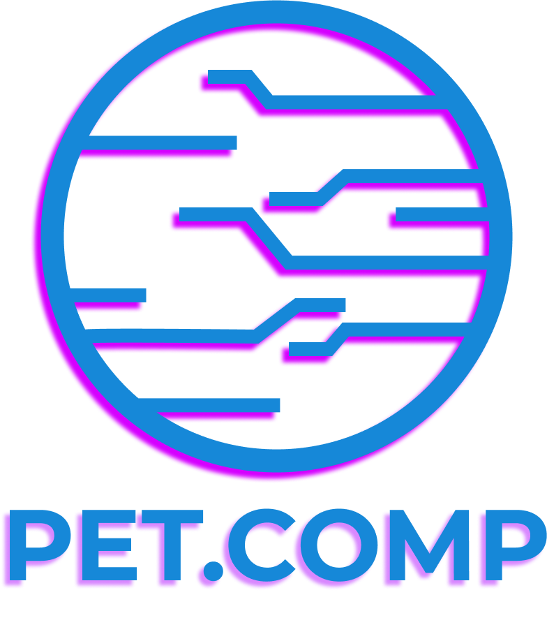

<h1>
    
     Contribuindo em um Projeto Open Source no GitHub
</h1>

Repositório desenvolvido para fins didaticos. Exercício prático do minicurso de Git/Github do [PET.COMP](https://www.petcomp.cefetmg.br/)

 

## Objetivo

Aprender a fazer uma contribuição a um projeto open source

## Ferramentas Utilizadas
  

## Pessoas que já fizeram uma contribuição

##

    Repositório criado por <a href = "https://github.com/arthurdx"> Arthur</a>

